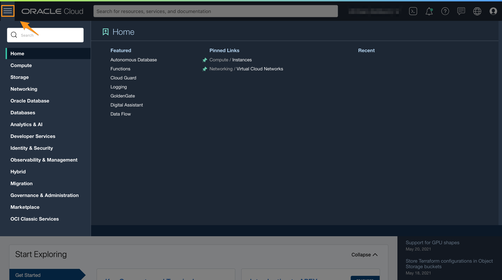
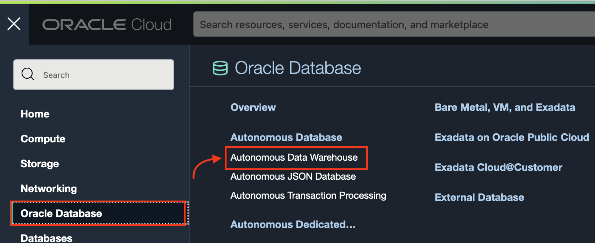

1. In the OCI Service Console, click the navigation menu in the upper left to show top level navigation choices.

     > **Note:** You can also directly access your Autonomous Data Warehouse service in the **Quick Actions** section of the dashboard.

    

2. Click **Autonomous Data Warehouse**.

    

3. Make sure your workload type is **Data Warehouse** or **All** to see your Autonomous Data Warehouse instances. <if type="freetier">Use the **List Scope** drop-down menu to select the compartment you just created.</if><if type="livelabs">In the **List Scope**, enter the first part of the LiveLabs compartment assigned to you, then select the compartment from the list.</if>

<if type="freetier">
    

   > **Note:** Avoid the use of the `ManagedCompartmentforPaaS` compartment as this is an Oracle default used for Oracle Platform Services.

</if>
<if type="livelabs">
    
</if>

4. This console shows that no databases yet exist. If there were a long list of databases, you could filter the list by the **State** of the databases (Available, Stopped, Terminated, for example). You can also sort by **Workload Type**. Here, the **Data Warehouse** workload type is selected.

<if type="freetier">
    
</if>
<if type="livelabs">
    
</if>

<if type="freetier">
6. If you are using a Free Trial or Always Free account, and you want to use Always Free Resources, you need to be in a region where Always Free Resources are available. You can see your current default **region** in the top, right hand corner of the page.

    
</if>

