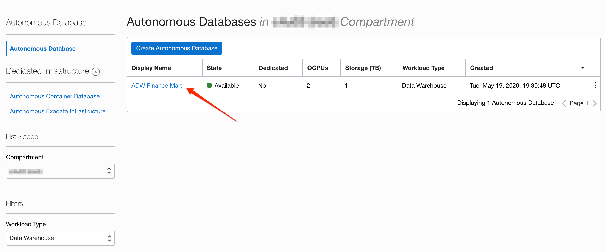
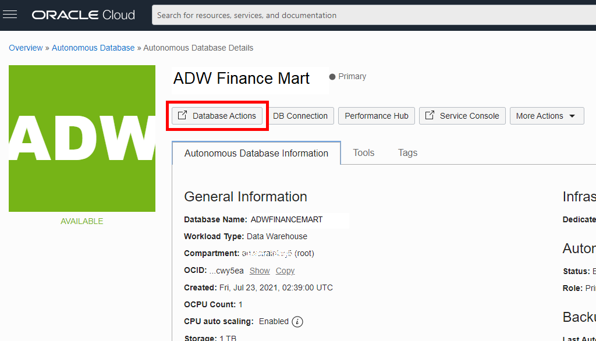
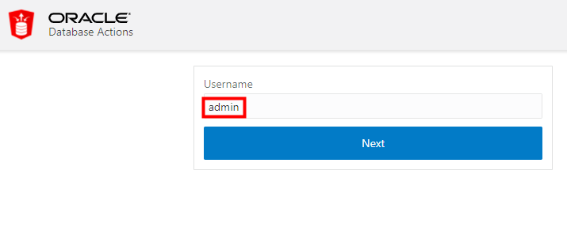
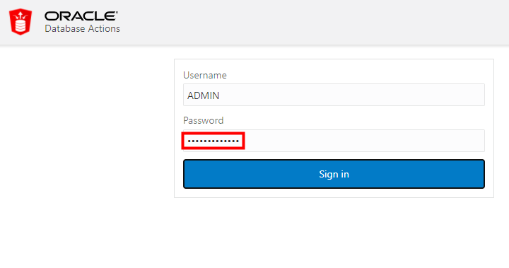
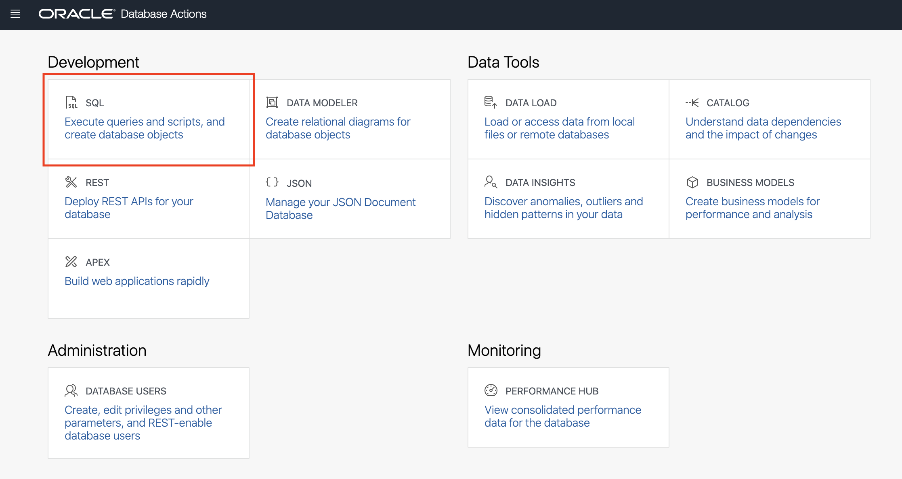

Although you can connect to your Oracle Autonomous Database using local PC desktop tools like Oracle SQL Developer, you can conveniently access the browser-based SQL Worksheet directly from your ADW or ATP console.

1.  If you are not logged in to Oracle Cloud Console, log in and select **Autonomous Data Warehouse** from the navigation menu, make sure you are in the right compartment where you ADW is provisioned and navigate into your ADW Finance Mart instance.

    

    

2. In your ADW Finance Mart database's details page, click the **Database Actions** button.

    

3.  A sign-in page opens for Database Actions. For this lab, simply use your database instance's default administrator account, **Username - admin**, and click **Next**.

    

4. Enter the admin **Password** you specified when creating the database. Click **Sign in**.

    

5. The Database Actions page opens. In the **Development** box, click **SQL**.

    

6.  The first time you open SQL Worksheet, a series of pop-up informational boxes may appear, providing you a tour that introduces the main features. If not, click the Tour button (labeled with binoculars symbol) in the upper right corner. Click **Next** to take a tour through the informational boxes.

    